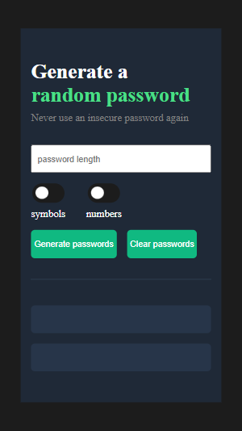
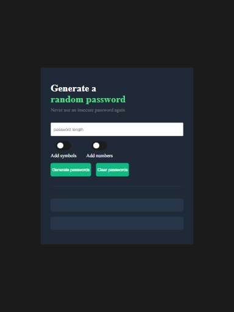
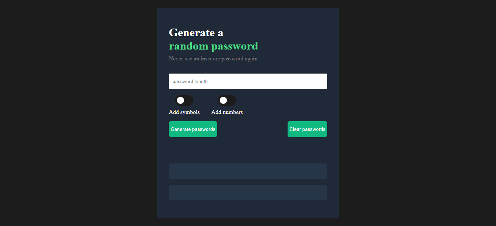

# Password Generator
## Scrimba frontend learning Path

This is a solution to scrimba frontend developer password generator solo project

## Table of contents

- [Overview](#overview)
  - [The challenge](#the-challenge)
  - [Screenshot](#screenshot)
  - [Links](#links)
- [My process](#my-process)
  - [Built with](#built-with)
  - [Continued development](#continued-development)
- [Author](#author)

## Overview

### The challenge

Users should be able to:

- View the optimal layout for the site depending on their device's screen size

- generate password with length of fifteen characters if user doesn't specify password length
- generate two different passwords
- Set password length
- Add "copy-on-click"
- Toggle "symbols" and "numbers" on/off


### Screenshot




### Links

- Solution URL: (https://github.com/ibimina/password-generator-)
- Live Site URL: (https://ibimina.github.io/password-generator/)

## My process

### Built with

- Semantic HTML5
- CSS custom properties
- Flexbox
- Grid
- Mobile-first workflow


### Proud of this 
This function checks if the conditions are true or false before generating the password
```js
const generate = (generatePass) => {
  let passwordLength = "";

  if (getLength) {
    passwordLength = getLength - 1;
    if (symbolToggle.checked && numberToggle.checked) {
      for (let i = 0; i <= passwordLength; i++) {
        let randomPassword = Math.floor(Math.random() * chara.length);
        generatePass += chara.substring(randomPassword, randomPassword + 1);
      }
      // console.log("g");
      return generatePass;
    } 
```

This copys the password to the clipboard when clicked
```js
function copyPassword(pass) {
  // console.log("hi");
  let text = pass;
  if (text.length) {
    let textArea = document.createElement("textarea");
    textArea.width = "1px";
    textArea.height = "1px";
    textArea.background = "transparents";
    textArea.value = text;
    console.log(textArea.value);
    document.body.append(textArea);
    textArea.select();
    document.execCommand("copy"); 
    document.body.removeChild(textArea);
  }


}

```

This function copy the password to the clipboard and displays a copied message for 2seconds
```js
firstPassword.addEventListener("click", (e) => {
   if (e.target) {
     let text = firstPassword.textContent;
     copyPassword(text);
     if (text.length) {
       copyFirstPassword.style.display = "block";
     }

     setInterval(() => {
       copyFirstPassword.style.display = "none";
     }, 2000);
   }
 });
```
### Continued development

Javascript and React framework


## Author

- Ibimina Hart
 - Frontend Mentor - [ibimina](https://www.frontendmentor.io/profile/ibimina)
 - Linkedin - [ibimina hart](https://www.linkedin.com/in/ibimina-hart)
- Twitter - [ibiminaaH](https://www.twitter.com/ibiminaaH)


